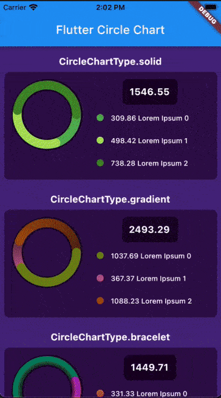

# Flutter Circle Chart

A Flutter package to create a Circle Chart with multiple drawing types. It will be useful for your awesome app.



### Example

```dart
import 'dart:math';
import 'dart:math' as math;

import 'package:flutter/material.dart';
import 'package:flutter_circle_chart/flutter_circle_chart.dart';

void main() => runApp(MyApp());

class MyApp extends StatefulWidget {
  @override
  _MyAppState createState() => _MyAppState();
}

class _MyAppState extends State<MyApp> {
  @override
  Widget build(BuildContext context) {
    return MaterialApp(
      title: 'Example',
      theme: ThemeData(
        primarySwatch: Colors.blue,
      ),
      home: Scaffold(
        backgroundColor: Color(0xff4C2882),
        appBar: AppBar(
          title: Text('Flutter Circle Chart'),
        ),
        body: SingleChildScrollView(
          child: Column(
            children: List.generate(
              CircleChartType.values.length,
              (index) => Padding(
                padding: const EdgeInsets.all(8.0),
                child: Column(
                  children: [
                    Padding(
                      padding: const EdgeInsets.all(8.0),
                      child: Text(
                        '${CircleChartType.values[index]}',
                        style: TextStyle(
                          fontSize: 16,
                          color: Colors.white,
                          fontWeight: FontWeight.bold,
                        ),
                      ),
                    ),
                    CircleChart(
                      chartType: CircleChartType.values[index],
                      items: List.generate(
                        3,
                        (index) => CircleChartItemData(
                          color: randomColor(),
                          value: 100 + Random.secure().nextDouble() * 1000,
                          name: 'Lorem Ipsum $index',
                          description:
                              'Lorem Ipsum $index không phải chỉ là một đoạn văn bản ngẫu nhiên.',
                        ),
                      ),
                    ),
                  ],
                ),
              ),
            ),
          ),
        ),
      ),
    );
  }
}

Color randomColor() {
  var g = math.Random.secure().nextInt(255);
  var b = math.Random.secure().nextInt(255);
  var r = math.Random.secure().nextInt(255);
  return Color.fromARGB(255, r, g, b);
}
```

### Development environment

```
[✓] Flutter (Channel stable, 2.0.5, on macOS 11.2.3 20D91 darwin-x64, locale en-VN)
    • Flutter version 2.0.5
    • Framework revision adc687823a (11 days ago), 2021-04-16 09:40:20 -0700
    • Engine revision b09f014e96
    • Dart version 2.12.3

[✓] Android toolchain - develop for Android devices (Android SDK version 30.0.3)
    • Platform android-30, build-tools 30.0.3
    • Java binary at: /Applications/Android Studio.app/Contents/jre/jdk/Contents/Home/bin/java
    • Java version OpenJDK Runtime Environment (build 1.8.0_242-release-1644-b3-6915495)
    • All Android licenses accepted.

[✓] Xcode - develop for iOS and macOS
    • Xcode at /Applications/Xcode_12.app/Contents/Developer
    • Xcode 12.4, Build version 12D4e
    • CocoaPods version 1.10.1

[✓] Chrome - develop for the web
    • Chrome at /Applications/Google Chrome.app/Contents/MacOS/Google Chrome

[✓] Android Studio (version 4.1)
    • Android Studio at /Applications/Android Studio.app/Contents
    • Flutter plugin can be installed from:
      🔨 https://plugins.jetbrains.com/plugin/9212-flutter
    • Dart plugin can be installed from:
      🔨 https://plugins.jetbrains.com/plugin/6351-dart
    • Java version OpenJDK Runtime Environment (build 1.8.0_242-release-1644-b3-6915495)
```